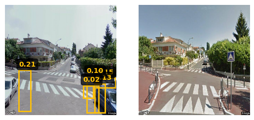

# CYWS-3D Street View Pipeline

Pipeline CYWS-3D adapté pour le traitement d'images street view. 




## Installation

**Clone the repository with submodules**
```bash
git clone --recursive https://github.com/IGNF/stage-2025-street-view.git
cd votre-repo
```

If you already cloned without `--recursive`:
```bash
git submodule update --init --recursive
```

**Install submodules**
```bash
# Install RoMa
cd RoMa
pip install -e .
cd ..

# Install SuperGlue
cd SuperGluePretrainedNetwork
pip install -e .
cd ..
```

**Install main dependencies**
```bash
pip install -r requirements.txt
```

**Install UniDepth v2**
```bash
pip install git+https://github.com/lpiccinelli-eth/UniDepth.git
```

## Pre-trained model

```bash
wget https://thor.robots.ox.ac.uk/cyws-3d/cyws-3d.ckpt.gz
gzip -d cyws-3d.ckpt.gz
```

## Example Usage

```bash
python inference_test.py --load_weights_from ./cyws-3d.ckpt
```

### Arguments

- `--load_weights_from` : Path to the pre-trained model weights (`.ckpt` file)

## References

This project builds upon the following works:

### CYWS-3D
```bibtex
@InProceedings{Sachdeva_ICCVW_2023,
  title = {The Change You Want to See (Now in 3D)},
  author = {Sachdeva, Ragav and Zisserman, Andrew},
  booktitle = {Proceedings of the IEEE/CVF International Conference on Computer Vision (ICCV)},
  year = {2023},
}
```
- **Paper**: [arXiv:2308.10417](https://arxiv.org/abs/2308.10417)
- **Original Repository**: [CYWS-3D](https://github.com/ragavsachdeva/CYWS-3D)

### RoMa (Robust Matching)
```bibtex
@inproceedings{edstedt2024roma,
  title={RoMa: Robust Dense Feature Matching},
  author={Edstedt, Johan and Sun, Qiyu and Bökman, Georg and Wadenbäck, Mårten and Felsberg, Michael},
  booktitle={Proceedings of the IEEE/CVF Conference on Computer Vision and Pattern Recognition},
  year={2024}
}
```
- **Repository**: [RoMa](https://github.com/Parskatt/RoMa)

### UniDepth v2
```bibtex
@article{piccinelli2024unidepth,
  title={UniDepth: Universal Monocular Metric Depth Estimation},
  author={Piccinelli, Luigi and Yang, Yung-Hsu and Sakaridis, Christos and Segu, Mattia and Li, Siyuan and Van Gool, Luc and Yu, Fisher},
  journal={arXiv preprint arXiv:2403.18913},
  year={2024}
}
```
- **Repository**: [UniDepth](https://github.com/lpiccinelli-eth/UniDepth)

### SuperGlue
```bibtex
@inproceedings{sarlin2020superglue,
  title={SuperGlue: Learning Feature Matching with Graph Neural Networks},
  author={Sarlin, Paul-Edouard and DeTone, Daniel and Malisiewicz, Tomasz and Rabinovich, Andrew},
  booktitle={Proceedings of the IEEE/CVF Conference on Computer Vision and Pattern Recognition},
  year={2020}
}
```
- **Repository**: [SuperGlue](https://github.com/magicleap/SuperGluePretrainedNetwork)

## Technologies Used

- **RoMa**: Robust feature matching for image pairs
- **SuperGlue**: Graph neural network for feature correspondence
- **UniDepth v2**: Monocular depth estimation
- **CYWS-3D**: Change detection and 3D reconstruction pipeline adapted for street view imagery

## Acknowledgements

This work adapts the CYWS-3D pipeline for street view image analysis. We thank the authors of CYWS-3D, RoMa, UniDepth, and SuperGlue for making their code publicly available.